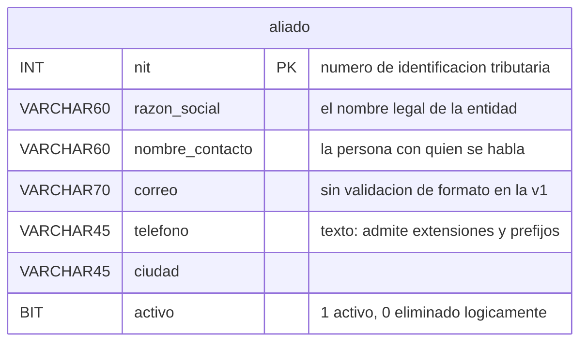

# Modelo de datos — Versión 1: la base dada y `aliado`

## 1. La base viene completa; la v1 nombra una tabla

La base `innovacion_local` se crea con sus **25 tablas** desde la primera
versión (Artículo 5): 22 del módulo y 3 de gestión de usuarios. Eso es
infraestructura **dada**, no algo que la v1 construya.

Lo que la v1 tiene permitido **nombrar en el código** es **una sola
tabla**: `aliado`. Cualquier `SELECT`, `INSERT` o `JOIN` que mencione otra
viola el alcance (Artículo 1).

## 2. La tabla `aliado`

| Columna | Tipo | Regla |
|---|---|---|
| `nit` | `INT` | **PK** — el número de identificación tributaria de la entidad |
| `razon_social` | `VARCHAR(60)` | No nulo, no vacío |
| `nombre_contacto` | `VARCHAR(60)` | No nulo, no vacío |
| `correo` | `VARCHAR(70)` | No nulo. **No se valida el formato** (C12) |
| `telefono` | `VARCHAR(45)` | No nulo. Texto, no número: admite extensiones y prefijos |
| `ciudad` | `VARCHAR(45)` | No nulo |
| `activo` | `BOOLEAN NOT NULL DEFAULT TRUE` | Borrado lógico (C4). La API la escribe **solo** vía `DELETE` |

**Por qué `telefono` es texto y no número:** los teléfonos llevan prefijos,
espacios, guiones y extensiones, y nunca se suman ni se ordenan
aritméticamente. Guardar como número perdería el cero inicial de un fijo.

## 3. Las semillas: ninguna, y a propósito

**`aliado` arranca vacía.** El Excel de referencia del módulo no trae
aliados, y no se inventan (C7).

Eso define el estado inicial del sistema y **da forma al smoke test**: el
primer `GET` responde **204**, y el recorrido completo —crear, listar,
actualizar, borrar, volver al 204— se puede correr desde cero, en cualquier
máquina, sin depender de datos previos.

Los catálogos que **sí** vienen cargados, aunque la v1 no los nombre:

| Tabla | Filas |
|---|---|
| `area_conocimiento` | 218 |
| `universidad` | 6 |
| Todas las demás | 0 |

> **`facultad` y `programa` quedan vacías aunque el Excel tenga 35 y 191
> filas** (C6): sus tablas exigen columnas que el Excel no trae y que no
> admiten nulos. Rellenarlas sería inventar datos. Es un problema de la
> v2, no de esta.

## 4. Invariantes: quién escribe qué

| Dato | Dueño | La API… |
|---|---|---|
| `nit` | Quien crea el registro | Lo escribe **solo** en el `POST`. Un `PUT` o un `PATCH` **nunca** lo cambian: identifica la fila |
| Los cinco campos restantes | La API | Los escribe libremente en `POST`, `PUT` y `PATCH` |
| `activo` | La API, pero **solo** por `DELETE` | **Tiene prohibido** recibirlo en el cuerpo. Si llega, se ignora: reactivar no está en el alcance |
| Las otras 24 tablas | Nadie, en la v1 | No las nombra |

## 5. Reglas de esta versión

1. Toda consulta va **parametrizada** (`@nit`, `@razonSocial`, …).
   Concatenar un valor en el SQL viola el Artículo 2.
2. Todo `SELECT` de listado lleva `WHERE activo = TRUE`.
3. La v1 no crea, altera ni borra objetos de la base: el esquema viene
   dado.
