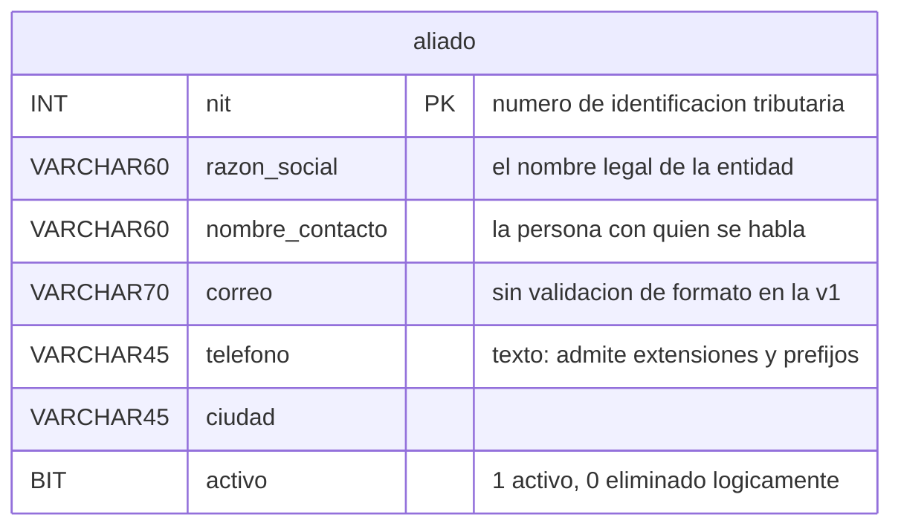

# Modelo de datos — Versión 1: la base dada y `aliado`

## 1. La base viene completa; la v1 nombra una tabla

La base `innovacion_local` se crea con sus **25 tablas** desde la primera
versión (Artículo 5): 22 del módulo y 3 de gestión de usuarios. Eso es
infraestructura **dada**, no algo que la v1 construya.

Lo que la v1 tiene permitido **nombrar en el código** es **una sola
tabla**: `aliado`. Cualquier `SELECT`, `INSERT` o `JOIN` que mencione otra
viola el alcance (Artículo 1).

## 2. La tabla `aliado`

| Columna | Tipo | Regla |
|---|---|---|
| `nit` | `INT` | **PK** — el número de identificación tributaria de la entidad |
| `razon_social` | `VARCHAR(60)` | No nulo, no vacío |
| `nombre_contacto` | `VARCHAR(60)` | No nulo, no vacío |
| `correo` | `VARCHAR(70)` | No nulo. **No se valida el formato** (C12) |
| `telefono` | `VARCHAR(45)` | No nulo. Texto, no número: admite extensiones y prefijos |
| `ciudad` | `VARCHAR(45)` | No nulo |
| `activo` | `BOOLEAN NOT NULL DEFAULT TRUE` | Borrado lógico (C4). La API la escribe **solo** vía `DELETE` |

**Por qué `telefono` es texto y no número:** los teléfonos llevan prefijos,
espacios, guiones y extensiones, y nunca se suman ni se ordenan
aritméticamente. Guardar como número perdería el cero inicial de un fijo.

## 3. Las semillas: 14 aliados de ejemplo, y se dice que lo son

**`aliado` arranca con 14 filas inventadas.** Aquí no hay nada que derivar:
la hoja `aliado` del Excel del módulo trae **la fila de cabeceras y ni un
solo dato**. Así que estas catorce no vienen de ninguna parte: se
escribieron para que la v1 tenga algo que mostrar (C7).

Y por eso lo importante de esta sección no es qué se sembró, sino **cómo se
marcó**:

| Campo | Cómo está hecho | Por qué |
|---|---|---|
| `correo` | Todos bajo `example.com` | Es el dominio que la **IANA reserva** para documentación: no le pertenece a nadie y nunca va a entregar un correo |
| `telefono` | Todos con `555` | El prefijo que por convención no corresponde a ninguna línea real |
| `nombre_contacto` | Personas inventadas | Es **el campo de datos personales de la tabla**. Ni aquí, ni en las capturas del curso, ni en un ejemplo de clase va el nombre de alguien real |
| `razon_social` y `nit` | Organizaciones y NIT inventados | Ninguna de las catorce existe |
| `ciudad` | Las **seis de la tabla `universidad`**, que esa sí viene del Excel | Un aliado en una ciudad donde el módulo no tiene sede no le sirve de ejemplo a nadie |

> **La regla que esto ilustra: un dato inventado que no se anuncia, se
> cita.** Termina en una diapositiva, en un informe o en la consulta de una
> versión posterior, y para entonces ya nadie recuerda que se lo inventó
> alguien un martes. Por eso el aviso no está solo aquí: está **dentro de
> `db/init.sql`, en el comentario que va justo encima del `INSERT`**, que
> es donde lo va a leer quien mire los datos.

Los catálogos que además vienen cargados, aunque la v1 no los nombre:

| Tabla | Filas |
|---|---|
| `aliado` | **14** (de ejemplo) |
| `area_conocimiento` | 218 |
| `universidad` | 6 |
| Todas las demás | 0 |

> **`facultad` y `programa` quedan vacías aunque el Excel tenga 35 y 191
> filas** (C6): sus tablas exigen columnas que el Excel no trae y que no
> admiten nulos. Es un problema de la v2, no de esta.
>
> **Y conviene decir que «rellenarlas sería inventar datos» era una
> respuesta perezosa.** El módulo de gestión profesoral sembró esa misma
> tabla `programa` con las 191 filas: dos de las columnas que faltaban
> —`nivel` y `ciudad`— **se derivan del propio Excel**, y solo cuatro se
> quedan sin origen. Cuando esta v2 llegue, el trabajo ya está hecho ahí
> y no hay que repetir la decisión desde cero.

## 4. Invariantes: quién escribe qué

| Dato | Dueño | La API… |
|---|---|---|
| `nit` | Quien crea el registro | Lo escribe **solo** en el `POST`. Un `PUT` o un `PATCH` **nunca** lo cambian: identifica la fila |
| Los cinco campos restantes | La API | Los escribe libremente en `POST`, `PUT` y `PATCH` |
| `activo` | La API, pero **solo** por `DELETE` | **Tiene prohibido** recibirlo en el cuerpo. Si llega, se ignora: reactivar no está en el alcance |
| Las otras 24 tablas | Nadie, en la v1 | No las nombra |

## 5. Reglas de esta versión

1. Toda consulta va **parametrizada** (`@nit`, `@razonSocial`, …).
   Concatenar un valor en el SQL viola el Artículo 2.
2. Todo `SELECT` de listado lleva `WHERE activo = TRUE`.
3. La v1 no crea, altera ni borra objetos de la base: el esquema viene
   dado.
